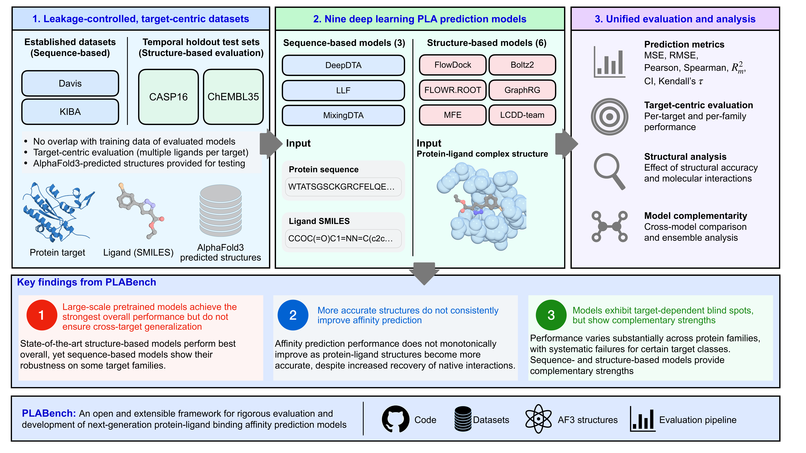
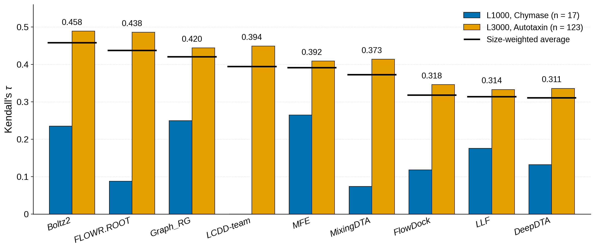
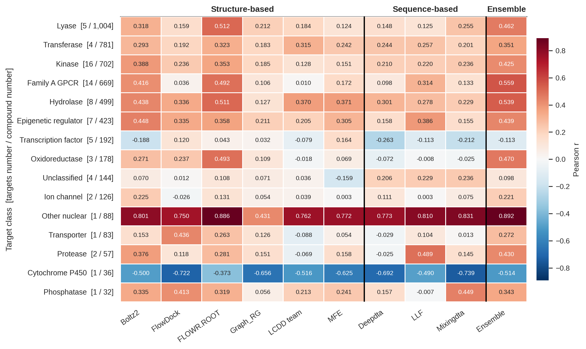

# PLABench

A benchmark for protein-ligand binding affinity prediction. It runs nine models,
sequence-based and structure-based, over the same targets under the same
metrics, and varies the input structure so that pose quality can be told apart
from model quality.

This is the code and data behind "Leakage-controlled benchmarking reveals
generalization limits of deep learning for protein-ligand binding affinity
prediction", by Lyuwei Wang and Jianlin Cheng. See [Citation](#citation).

```bash
git clone --recurse-submodules https://github.com/BioinfoMachineLearning/PLABench.git
python run_benchmark.py model=boltz2 dataset=af3_chembl35_full
```

Each model needs its own conda environment and its own weights, so read
[Install](#install) before the second line.

## Results

Every number and figure below is reproduced from `results/`. Full tables,
including the leakage-filtered arms and the per-target breakdowns, are in
`results/README.md`.

### Overview



### Davis and KIBA, five-fold cross-validation

The three sequence models retrained on the splits MixingDTA defined
(`results/benchmark_summary.csv`).

| Split | Model | Davis RMSE | Pearson | Spearman | CI | KIBA RMSE | Pearson | Spearman | CI |
| --- | --- | --- | --- | --- | --- | --- | --- | --- | --- |
| Warm start | DeepDTA | 0.482 | 0.816 | 0.658 | 0.875 | 0.479 | 0.818 | 0.798 | 0.831 |
| | LLF | 0.473 | 0.821 | 0.669 | 0.881 | **0.394** | **0.882** | **0.873** | **0.883** |
| | MixingDTA | **0.462** | **0.830** | **0.681** | **0.890** | 0.404 | 0.876 | 0.871 | 0.878 |
| Cold target | DeepDTA | 0.617 | 0.625 | 0.521 | 0.800 | 0.714 | 0.558 | 0.522 | 0.698 |
| | LLF | 0.673 | 0.514 | 0.450 | 0.756 | **0.585** | **0.726** | **0.735** | **0.795** |
| | MixingDTA | **0.541** | **0.727** | **0.586** | **0.841** | 0.598 | 0.712 | 0.656 | 0.761 |
| Cold drug | DeepDTA | 0.811 | 0.330 | 0.344 | 0.680 | 0.662 | 0.565 | 0.556 | 0.712 |
| | LLF | 0.843 | 0.278 | 0.313 | 0.663 | 0.676 | 0.548 | 0.566 | 0.715 |
| | MixingDTA | **0.735** | **0.515** | **0.447** | **0.738** | **0.583** | **0.680** | **0.650** | **0.756** |

### CASP16 stage 1

Kendall's tau on the two ligand series, with the black rule giving the
size-weighted average over all 140 compounds
(`results/casp16/casp16_stage1_kendall.csv`).



### ChEMBL35

4,862 ligands over 71 targets, after the leakage filter: every test ligand
within ECFP4 Tanimoto 0.85 of any ligand in the fourteen audited training
corpora is dropped, then targets left with fewer than ten ligands go too
(`results/chembl35/weighted_summary_chembl35_filtered.csv`). The unfiltered
arm, 7,650 ligands over all 84 targets, is in the same directory.

| Model | MSE | RMSE | Pearson | Spearman | Kendall | Rm2 | CI |
| --- | --- | --- | --- | --- | --- | --- | --- |
| Boltz2 | 1.692 | 1.248 | 0.321 | 0.302 | 0.211 | 0.098 | 0.606 |
| FlowDock | 2.216 | 1.369 | 0.188 | 0.173 | 0.120 | 0.051 | 0.560 |
| FLOWR.ROOT | **0.931** | **0.928** | **0.392** | **0.374** | **0.264** | **0.168** | **0.632** |
| Graph_RG | 1.973 | 1.340 | 0.146 | 0.128 | 0.089 | 0.035 | 0.544 |
| LCDD-team | 1.636 | 1.221 | 0.157 | 0.131 | 0.091 | 0.038 | 0.545 |
| MFE | 1.626 | 1.212 | 0.177 | 0.162 | 0.111 | 0.048 | 0.556 |
| DeepDTA | 2.165 | 1.393 | 0.153 | 0.151 | 0.103 | 0.045 | 0.551 |
| LLF | 2.503 | 1.462 | 0.212 | 0.208 | 0.144 | 0.072 | 0.572 |
| MixingDTA | 1.814 | 1.272 | 0.173 | 0.162 | 0.112 | 0.048 | 0.556 |

FLOWR.ROOT leads even after the filter, but the filter is what makes that
readable. SAIR, the corpus it trains on, is built from ChEMBL 35 and reaches
Tanimoto 0.85 against 32.7% of the unfiltered benchmark, which is 2,413 of the
2,735 rows the similarity cut removes.
`results/chembl35_leakage/leak_by_corpus.csv` gives the per-corpus breakdown.

### Per-family accuracy

Pearson correlation for each model on each protein family, over the filtered
ChEMBL35 arm plus the two CASP16 series
(`results/chembl35/per_class_pearson_wide_chembl35_casp16_filtered.csv`).



## Install

Clone with the model sources, which are git submodules under `forks/`:

```bash
git clone --recurse-submodules https://github.com/BioinfoMachineLearning/PLABench.git
```

If you already cloned without them, `git submodule update --init` fills
`forks/` in. Each fork sits on a `plabench` branch holding the exact upstream
commit that was benchmarked plus the patches needed to run it; `forks/README.md`
lists those patches.

Every model runs in its own conda environment, since their dependencies
conflict. See [Environments](#environments) below for how to point the benchmark
at yours.

## Checkpoints

The weights PLABench trained itself (DeepDTA, LLF and MixingDTA on PDBbind,
MixingDTA's Davis and KIBA cold-start folds, and MFE) ship in archive 3 of the
Zenodo deposit. `bash scripts/download_checkpoints.sh` fetches it from there and
checks the SHA256; both are baked into the script, so it takes no arguments. The
benchmark also attempts this by itself when a configured checkpoint is missing.
To install from a local copy or a mirror instead, set `PLABENCH_CHECKPOINT_URL`,
and `PLABENCH_CHECKPOINT_SHA256=""` to skip the checksum test.

Third-party weights are never re-uploaded. That covers Boltz-2, FLOWR.ROOT,
FlowDock, BA-Pred, Graph_RG/Haiping, ESM3, and the MixingDTA authors' Davis and
KIBA warm-start models. `checkpoints/THIRD_PARTY.tsv` records the official URL,
SHA256 and license of each file, and `bash scripts/download_third_party.sh`
fetches and verifies them. Boltz-2 is the exception: it downloads itself into
`~/.boltz/` on first use.

`checkpoints/README.md` has the directory layout and the full inventory.

## Data

Benchmark inputs, ground truth and the AlphaFold3 structures are too large for
git and live on Zenodo instead, at
[doi:10.5281/zenodo.22716174](https://doi.org/10.5281/zenodo.22716174). Four
archives, about 6 GB, unpacking over `data/`, `checkpoints/`, `outputs/` and
`results/`:

| Archive | Holds |
| --- | --- |
| `01_benchmark_inputs` | Split partitions, the filtered and full ChEMBL35 sets with their removal ledger, the CASP16 labels, SMILES and stage-1 inputs, the standardized CASF and CSAR-HiQ affinity tables, every Davis and KIBA fold, and `SOURCES.tsv` |
| `02_af3_structures` | The predicted structures the benchmark scored: AlphaFold3 for ChEMBL35 and CASP16, Boltz-2 for CASP16, CASF and CSAR-HiQ, plus the template-guided CASP16 rung |
| `03_checkpoints` | The weights PLABench trained, and the third-party inventory |
| `04_predictions_and_metrics` | Every per-model prediction, the leakage tables and the scored metrics |

Unpack archives 1, 2 and 4, and 46 of the 68 dataset configs run as they are.
The other 22 wait on a corpus nobody may redistribute: the CASF core sets, the
CSAR-HiQ structures, or the CASP16 stage-2 complexes. Each is a registration or
a download away, and the bullets below say where.

What ships is decided by who made it: PLABench artifacts go in, corpora other
people built are linked instead. `checkpoints/` splits the same way, between
`MANIFEST.tsv` and `THIRD_PARTY.tsv`. `data/SOURCES.tsv` gives the call, the
origin and the license for every path the benchmark reads, 25 of them. Four of
those calls change what you get:

- PDBbind v2020 forbids redistribution without written permission, so the
  deposit carries the 4,465 / 497 refined partition as `compound_id,split` and
  nothing else. Rejoin it against
  [photonmz/pdbbindpp-2020](https://huggingface.co/datasets/photonmz/pdbbindpp-2020).
- CSAR-HiQ never came with terms that allow redistribution and its portal is
  gone, so the 36 and 51 structure sets are not shipped. The standardized
  PDB-code / SMILES / pKd tables are, which is enough to rescore once you have
  the complexes. Binding MOAD's
  [download page](https://bindingmoad.org/Home/download) still serves the
  CSAR-NRC HiQ set and its update, but Binding MOAD is sunset and static now, so
  fetching the 87 entries from the [RCSB](https://www.rcsb.org/) by PDB code is
  the safer route.
- CASF-2013 and CASF-2016 come from the CASF authors under their own terms, so
  the two core sets are not shipped either. Request them at
  [pdbbind.org.cn/casf.php](http://www.pdbbind.org.cn/casf.php). The Boltz-2
  poses for both are in archive 2 and the standardized affinity tables in
  archive 1, so only the experimental arms wait on the request.
- The experimental CASP16 stage-2 complexes are the organizers' release. No
  number in the paper needs them: CASP16 is scored against the labels in archive
  1, and `configs/manifests/` records which targets each stage-2 run covered, so
  `scripts/collect_results.py` still reports 93 of 93 with `data/` half empty.
  Re-running the six stage-2 configs does need them, from the
  [Prediction Center](https://predictioncenter.org/casp16/).

MFE reads its structures as one directory per complex holding `protein.pdb` and
`ligand.mol2`. Those eight `data/*_prepared` directories are symlink farms with
no bytes of their own, so they are not deposited. Rebuild them after unpacking:

```bash
python scripts/data_prep/link_mfe_inputs.py
```

The four that point at Boltz-2 poses work straight from archive 2; the other
four wait on CASF and CSAR-HiQ.

Davis and KIBA are complete: train, validation and test, for the warm-start arm
and for both cold-start arms. Everything except the test folds is in the pickle
format [MixingDTA](https://github.com/rokieplayer20/MixingDTA) released, because
the target sequence repeats on every row and pickle stores it once, which is
28 MB against 621 MB for the same folds as CSV. For CSVs with the same four
columns as the test files:

```bash
python scripts/cv/export_davis_kiba_folds.py
```

It rebuilds every CSV that already exists before writing anything, so a change
in the pickled row layout fails there rather than in a training run.

The AlphaFold3 structures are distributable under the AlphaFold3 Output Terms of
Use, non-commercially, and the archive carries the modification notice those
terms require. No AlphaFold3 model parameters are redistributed anywhere here.

`bash scripts/package_zenodo.sh --dry-run` lists what each archive holds; that
script is what built the deposit.

## Running a benchmark

Everything except the Davis and KIBA cross-validation runs through Hydra:

```bash
python run_benchmark.py model=<model> dataset=<dataset>
```

`configs/model/` holds one file per model (`bapred`, `boltz2`, `deepdta`,
`flowdock`, `flowr_root`, `haiping`, `llf`, `mfe`, `mixingdta`), each naming the
checkpoint, the model source under `forks/`, and the interpreter to run it with.
`configs/dataset/` holds the 68 evaluation settings the paper reports, one per
combination of input source, benchmark and evaluation mode. Their names encode
which is which, so read `configs/README.md` before picking one; the ordering of
tokens in a name is easy to misread. Runs that did not make the paper are in
`archive/configs/dataset/`.

Predictions land in `outputs/<model>/<dataset>/latest/`. Score them from the
analysis environment (`environments/analysis.yaml`, see below) with
`python scripts/collect_results.py`, which refreshes
`results/benchmark_summary.csv` and the per-target tables, then
`python scripts/weighted_summary.py` for the weighted aggregates.
`scripts/README.md` says what each of the remaining scripts produces and in what
order to run them.

Override any config field on the command line:

```bash
python run_benchmark.py model=mfe dataset=af3_chembl35_full ++model.device=cpu
```

## Davis and KIBA cross-validation

The three sequence models are cross-validated over five folds in three regimes
(warm start, cold drug, cold target), which the generic runner does not cover.
Use the dedicated runners, one per model, then score them together:

```bash
python scripts/cv/run_deepdta_cv.py          # or a subset: davis_warm kiba_cold_drug
python scripts/cv/run_llf_cv.py
python scripts/cv/run_mixingdta_cv.py
python scripts/cv/collect_kiba_davis_cv.py   # add --dry-run to score without rewriting the summary
```

Each runner writes `outputs/<model>/<config>/fold_<n>/predictions.csv`, one row
per ground-truth row in the same order. The collector reads that one layout for
all three models, averages the folds, and refreshes the Davis and KIBA rows of
`results/benchmark_summary.csv`. Per-fold metrics land in
`analysis/davis_kiba_cv_metrics.csv`.

MixingDTA cold-start inference needs `forks/MixingDTA` initialized even if you
skip the other submodules. It reads the authors' pickled test sets from there,
because it looks up per-compound and per-target embeddings by identifiers the
CSV copies do not carry. The pickles are row-identical to the CSV ground truth.

## Environments

Every model has its own conda environment, exported to `environments/`. Create
one with `conda env create -f environments/<model>.yaml`;
`environments/README.md` covers the two post-create steps a conda export cannot
carry, and how AlphaFold3 was built.

The analysis scripts get a tenth environment of their own, `analysis.yaml`. It
runs no model, so it installs in a couple of minutes, and it is what everything
under `scripts/` was run in:

```bash
conda env create -f environments/analysis.yaml
conda activate plabench-analysis
python scripts/collect_results.py
```

Five models are spawned as a subprocess, so they take a path. Override it with
an environment variable rather than editing `configs/model/*.yaml`:

| Variable | Model | Wants |
| --- | --- | --- |
| `BOLTZ2_ENV` | Boltz-2 | conda prefix |
| `FLOWDOCK_PYTHON` | FlowDock | interpreter |
| `FLOWR_ROOT_PYTHON` | FLOWR.ROOT | interpreter |
| `LLF_PYTHON` | LLF | interpreter |
| `MIXINGDTA_PYTHON` | MixingDTA | interpreter |
| `DEEPDTA_PYTHON` | DeepDTA, cross-validation runner only | interpreter |

LCDD-team, Graph_RG, MFE and the non-CV DeepDTA runs use the interpreter that
started `run_benchmark.py`, so activate their environment and launch from
inside it.

`MIXINGDTA_ROOT` points the MixingDTA runner at a checkout other than
`forks/MixingDTA`, and `PLABENCH_DEVICE` sets the torch device for the
cross-validation runners.

## Versions and commit hashes

Every number in the paper was produced by the code pinned in the three tables
below: the nine model forks, the external tools, and the hardware each model ran
on.

### Model forks

Each submodule is pinned to a commit on the `plabench` branch of its fork, which
is the upstream commit listed here plus the benchmark patches. `forks/README.md`
gives the patch list per fork; `git submodule status` prints the pinned SHAs of
your own checkout.

| Model | Submodule | Upstream | Upstream commit | `plabench` commit |
| --- | --- | --- | --- | --- |
| Boltz2 | `forks/boltz` | jwohlwend/boltz | 832486d (2025-09-01) | f74ebf1 (v2.2.0-39) |
| FLOWR.ROOT | `forks/flowr_root` | jule-c/flowr_root | 9ff49e8 (2026-04-15) | 9ff49e8 (v1.0, unpatched) |
| FlowDock | `forks/MULTICOM_ligand` | BioinfoMachineLearning/MULTICOM_ligand | 99f3da2 (2025-09-13) | a9a5ef2 (v0.4.0-10) |
| Graph_RG | `forks/haiping_methods` | haiping1010/haiping_methods | d787e31 (2024-10-24) | 64b66b3 |
| LCDD-team | `forks/BA-Pred` | eightmm/BA-Pred | 4c2ce61 (2025-10-27) | 05acf82 |
| MFE | `forks/MFE` | Sultans0fSwing/MFE | f807cb7 (2024-03-30) | 18d2154 |
| DeepDTA | `forks/DeepDTA-Pytorch` | KSUN63/DeepDTA-Pytorch | 78c1ffb (2024-12-03) | ea9f4e7 |
| LLF | `forks/LLF` | Koreaj9u7n/LLF | 88b334f (2024-06-07) | 22eae99 |
| MixingDTA | `forks/MixingDTA` | rokieplayer20/MixingDTA | 73492fc (2025-04-04) | 31e2f6a |

### External tools

| Tool | Version | Used for |
| --- | --- | --- |
| AlphaFold3 | 3.0.1, commit a8ecdb2 (2025-09-08) | the AF3 input structures for ChEMBL35 and CASP16 |
| Boltz-2 CLI | 2.2.0 | co-folded structures for the pose ladder, and the Boltz2 arm itself |
| RDKit | 2024.03.5 | fingerprints and standardization in the leakage audit |
| ESM3 | `esm` 3.1.1, `esm3-sm-open-v1` weights | MixingDTA protein embeddings |
| MoLFormer-XL | `ibm/MoLFormer-XL-both-10pct` | MixingDTA ligand embeddings |
| ProtBert | `Rostlab/prot_bert` | MFE protein embeddings |

Weight files are inventoried separately: `checkpoints/THIRD_PARTY.tsv` records
the official download URL, SHA256 and license of every third-party checkpoint,
and `checkpoints/MANIFEST.tsv` covers the ones PLABench trained.

### Runtime per model

The environment each model was benchmarked in. They conflict, which is why there
is one per model. `environments/` holds a conda export of all nine, and
`environments/README.md` is the install guide.

| Model | Python | PyTorch | RDKit | Also |
| --- | --- | --- | --- | --- |
| Boltz2 | 3.11 | 2.8.0 | 2025.03.6 | boltz 2.2.0, numpy 1.26.4 |
| FLOWR.ROOT | 3.12.12 | 2.5.1 | 2025.03.6 | torch-geometric 2.7.0 |
| FlowDock | 3.10 | 2.2.1 | 2024.09.6 | torch-geometric 2.5.2 |
| Graph_RG | 3.8 | 1.5.1 | 2022.09.5 | torch-geometric 2.0.4 |
| LCDD-team | 3.11 | 2.4.0+cu124 | 2025.03.5 | dgl 2.4.0+cu124 |
| MFE | 3.8 | 1.12.0+cu113 | 2023.09.5 | torch-geometric 2.4.0, transformers 4.35.2 |
| DeepDTA | 3.8 | 2.1.0 | 2024.03.5 | numpy 1.24.1 |
| LLF | 3.7 | 1.13.1 | 2022.09.5 | torch-geometric 2.3.1 |
| MixingDTA | 3.10 | 2.3.1 | 2023.09.6 | esm 3.1.1, transformers 4.30.2 |

## Layout

| Path | Contents |
| --- | --- |
| `configs/` | Hydra model and dataset configs. See `configs/README.md` |
| `forks/` | Model sources as submodules. See `forks/README.md` |
| `plabench/` | The benchmark itself: model adapters, metrics, data preparation |
| `scripts/` | Result collection, tables, figures, leakage audit. See `scripts/README.md` |
| `checkpoints/` | Weight inventory and download scripts. See `checkpoints/README.md` |
| `data/` | Benchmark inputs and ground truth, not in git. See [Data](#data) |
| `outputs/` | Per-run predictions, not in git. The scored ones are on Zenodo |
| `results/` | Scored tables and paper figures. See `results/README.md` |

## Citation

```bibtex
@unpublished{wang2026plabench,
  title  = {Leakage-controlled benchmarking reveals generalization limits of
            deep learning for protein-ligand binding affinity prediction},
  author = {Wang, Lyuwei and Cheng, Jianlin},
  year   = {2026},
  note   = {Manuscript in submission}
}
```

The benchmark inputs, structures, checkpoints and predictions have their own
DOI, [10.5281/zenodo.22716174](https://doi.org/10.5281/zenodo.22716174). Cite it
too if you use the data on its own.

If you report a number from one of the nine models, cite that model's own paper
as well. `forks/README.md` lists them.

## License

The code is MIT, in `LICENSE`. The data and the weights are not, and each
carries the terms of whoever produced it:

| What | Terms |
| --- | --- |
| ChEMBL35 benchmark sets | The Shimizu et al. release they are cut from is CC-BY 4.0; the filtered arm carries ChEMBL's CC-BY-SA 3.0, and share-alike propagates from there |
| Davis and KIBA folds, target class map | CC-BY 4.0 |
| CASP16 stage-1 targets | Converted to pKd here; the Prediction Center publishes no redistribution grant for the raw target files |
| AlphaFold3 structures | AlphaFold3 Output Terms of Use, non-commercial. Distributable, but they must not be used to train structure-prediction models |
| Third-party checkpoints | Whatever each release says. `checkpoints/THIRD_PARTY.tsv` records it per file |
| PDBbind v2020, CSAR-HiQ | Not redistributed at all. See [Data](#data) |

`data/SOURCES.tsv` is the per-path record and is the file to check before
reusing anything here.
